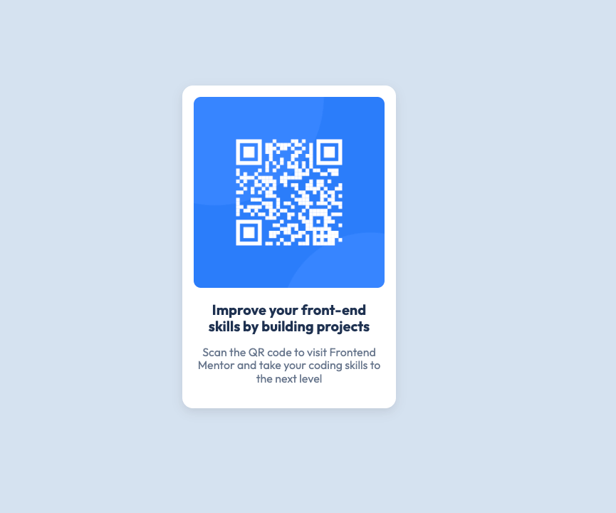

# Frontend Mentor - QR Code Component Solution

This is my solution to the [QR Code Component Challenge](https://www.frontendmentor.io/challenges/qr-code-component-iux_sIO_H) on Frontend Mentor. This challenge helped me practice creating reusable components using semantic HTML and responsive CSS.

## Table of Contents

- [Overview](#overview)
  - [Screenshot](#screenshot)
  - [Links](#links)
- [My Process](#my-process)
  - [Built With](#built-with)
  - [What I Learned](#what-i-learned)
  - [Continued Development](#continued-development)
  - [Useful Resources](#useful-resources)
- [Author](#author)

## Overview

### Screenshot



### Links

- [Solution on Frontend Mentor](https://www.frontendmentor.io/solutions/qr-code-component-solution-using-scss-and-responsive-design-HY0OjRkf5n)
- [Live Site](https://georgepapalazaridis.github.io/qr-code-component/)

## My Process

### Built With

- Semantic HTML5
- CSS custom properties
- SCSS for styles
- Flexbox
- Mobile-first workflow
- Git for version control

### What I Learned

This project reinforced my understanding of:
- Using **SCSS** to organize and manage styles effectively.
- The importance of responsive design, achieved using a **mobile-first approach** and media queries.
- Setting up a project for deployment using **GitHub Pages**.
- Implementing hover and focus effects for better interactivity and accessibility.

#### Key Code Snippet:
Here’s an example of how I handled hover and focus effects to ensure smooth interactions:
```css
.qr-link:hover .qr-code-card, 
.qr-link:focus .qr-code-card {
    box-shadow: 0 8px 20px rgba(0, 0, 0, 0.2);
    transform: scale(1.02);
    cursor: pointer;
}
